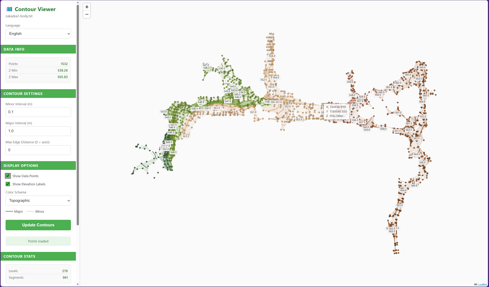

# Point Cloud Contour Generator

Generate contour lines from terrain point cloud data with Delaunay triangulation and edge filtering.

## Usage

```bash
uv run contourer data/zakazka-body.txt [options]
```

### Output Files

Output files are automatically named based on the input filename and saved to `./data/out/`:
- `<inputFileName>_contour.txt` - Contour line data in custom text format
- `<inputFileName>_contour.geojson` - Contour line data in GeoJSON format
- `<inputFileName>_contour.dxf` - Contour line data in DXF format (for AutoCAD/CAD software)
- `<inputFileName>_map.pdf` - Visualization PDF

By default, all formats are exported. Use `--formats` to select specific formats.

### Options

| Option | Description |
|--------|-------------|
| `--levels 495 496 ...` | Custom Z contour levels (auto-generated if omitted) |
| `--minor-interval 0.2` | Interval for minor contour lines (overrides --levels) |
| `--major-interval 1.0` | Interval for major contour lines (visualization only, defaults to 5× minor) |
| `--max-distance 5.0` | Max triangle edge length filter (default: 1.5× median) |
| `--formats pdf,txt,...` | Comma-separated export formats: pdf, txt, geojson, dxf (default: all) |
| `--show-points` | Show original data points on the visualization |
| `--web` | Launch interactive browser-based viewer |
| `--port 5000` | Port for web server (default: 5000) |

### Examples

```bash
# Auto levels (generates all formats: .txt, .geojson, .dxf, and .pdf)
uv run contourer data/zakazka-body.txt

# Export only specific formats
uv run contourer data/zakazka-body.txt --formats pdf,dxf

# Export only DXF for CAD software
uv run contourer data/zakazka-body.txt --formats dxf

# Major and minor contours at 0.2 and 1 meter
uv run contourer data/zakazka-body.txt --minor-interval 0.2 --major-interval 1

# Show original data points on the map
uv run contourer data/zakazka-body.txt --show-points

# Custom levels
uv run contourer data/zakazka-body.txt --levels 495 496 497 498 499 500

# Launch interactive web viewer
uv run contourer data/zakazka-body.txt --web

# Web viewer on custom port
uv run contourer data/zakazka-body.txt --web --port 8080
```

## Interactive Web Viewer

Launch a browser-based interactive map with `--web`:

```bash
uv run contourer data/zakazka-body.txt --web
```



**Features:**
- 🔍 **Zoom & Pan** - Contour lines maintain constant width at any zoom level
- ⚙️ **Live Settings** - Adjust minor/major intervals and regenerate on the fly
- 📍 **Show Points** - Toggle original data points visibility
- 🎨 **Color Schemes** - Switch between Terrain, Viridis, Monochrome, Topographic
- 🏷️ **Elevation Labels** - Toggle labels on major contours
- 💡 **Hover Tooltips** - See exact elevation on hover
- 🧊 **3D View** - Interactive 3D terrain visualization with AutoCAD-style controls

### 3D View

Switch to the 3D view by clicking the **3D View** tab in the sidebar. The 3D view displays the terrain as a mesh with contour lines overlaid.

**3D Navigation Controls:**

| Control | Action |
|---------|--------|
| Left-click + drag | Pan the view |
| Right-click + drag | Orbit/rotate around the terrain |
| Scroll wheel / pinch | Zoom in/out |

**3D-specific settings:**
- **Z Scale** - Adjust vertical exaggeration to emphasize terrain relief

## Input Format

Space-separated: `ID X Y Z` (columns 2-4 used)

## Output Formats

By default, all formats are exported. Use `--formats` to select specific ones:

```bash
# Export only PDF and DXF
uv run contourer data/zakazka-body.txt --formats pdf,dxf
```

- **txt**: `z: elevation` followed by `x, y` coordinates per segment (custom format)
- **geojson**: GeoJSON FeatureCollection with LineString geometries
- **dxf**: AutoCAD DXF format with contour lines as 3D polylines, organized by layer:
  - Each elevation level has its own layer (e.g., `CONTOUR_496_50`)
  - Major contour levels use `CONTOUR_MAJOR_<elevation>` layers with thicker lines
  - Polylines include Z coordinate at the contour elevation
  - Compatible with AutoCAD, QGIS, and other CAD/GIS software
- **pdf**: Visualization map with filled contours, contour lines, and elevation labels
