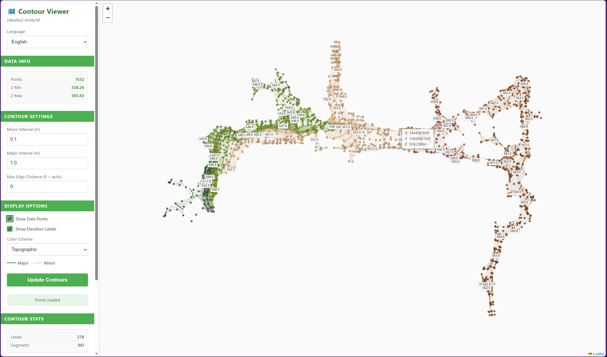
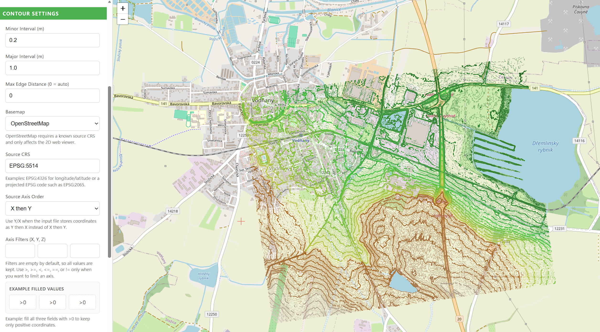

# Point Cloud Contour Generator

Generate contour lines from terrain point cloud data with Delaunay triangulation and edge filtering.

## Usage

```bash
uv run contourer data/zakazka-body.txt [options]
```

### Output Files

Output files are automatically named based on the input filename and saved to the same directory as the input file:
- `<inputFileName>_contour.vrs` - Contour line data in custom text format
- `<inputFileName>_contour.geojson` - Contour line data in GeoJSON format
- `<inputFileName>_contour.dxf` - Contour line data in DXF format (for AutoCAD/CAD software)
- `<inputFileName>_contour.pdf` - Visualization PDF

By default, all formats are exported. Use `--formats` to select specific formats.

### Options

| Option | Description |
|--------|-------------|
| `--levels 495 496 ...` | Custom Z contour levels (auto-generated if omitted) |
| `--minor-interval 0.2` | Interval for minor contour lines (overrides --levels) |
| `--major-interval 1.0` | Interval for major contour lines (visualization only, defaults to 5× minor) |
| `--max-distance 5.0` | Max triangle edge length filter (default: 1.5× median) |
| `--basemap osm` | 2D web viewer basemap. Use `none` for the current local-coordinate view or `osm` for OpenStreetMap. |
| `--source-crs EPSG:2065` | Known source CRS for 2D web map reprojection. Required when using `--basemap osm`. |
| `--source-axis-order yx` | Axis order of the source coordinates in the input file: `xy` or `yx`. Use `yx` when the file stores coordinates as `Y X Z`. |
| `--formats pdf,vrs,...` | Comma-separated export formats: pdf, vrs, geojson, dxf (default: all) |
| `--show-points` | Show original data points on the visualization |
| `--show-point-labels` | Show parsed point labels in the PDF export and start the web viewer with point labels enabled |
| `--web` | Launch interactive browser-based viewer |
| `--port 5000` | Port for web server (default: 5000) |

### Examples

```bash
# Auto levels (generates all formats: .vrs, .geojson, .dxf, and .pdf)
uv run contourer data/zakazka-body.txt

# Export only specific formats
uv run contourer data/zakazka-body.txt --formats pdf,dxf

# Export only DXF for CAD software
uv run contourer data/zakazka-body.txt --formats dxf

# Major and minor contours at 0.2 and 1 meter
uv run contourer data/zakazka-body.txt --minor-interval 0.2 --major-interval 1

# Show original data points on the map
uv run contourer data/zakazka-body.txt --show-points

# Show parsed point labels in the exported PDF
uv run contourer data/zakazka-body.txt --show-point-labels

# Custom levels
uv run contourer data/zakazka-body.txt --levels 495 496 497 498 499 500

# Launch interactive web viewer
uv run contourer data/zakazka-body.txt --web

# Launch web viewer with an OpenStreetMap underlay for WGS84 data
uv run contourer data/zakazka-body.txt --web --basemap osm --source-crs EPSG:4326

# Launch web viewer with an OpenStreetMap underlay for projected survey data
uv run contourer data/zakazka-body.txt --web --basemap osm --source-crs EPSG:2065 --source-axis-order yx

# Web viewer on custom port
uv run contourer data/zakazka-body.txt --web --port 8080
```

## Interactive Web Viewer

Launch a browser-based interactive map with `--web`:

```bash
uv run contourer data/zakazka-body.txt --web
```



**Features:**
- 🔍 **Zoom & Pan** - Contour lines maintain constant width at any zoom level
- ⚙️ **Live Settings** - Adjust minor/major intervals and regenerate on the fly
- 🗺️ **Optional OSM Underlay** - Switch the 2D map between local coordinates and OpenStreetMap when you know the source CRS
- 📍 **Show Points** - Toggle original data points visibility
- 🏷️ **Show Point Labels** - Toggle parsed point labels independently from point markers
- 🎨 **Color Schemes** - Switch between Terrain, Viridis, Monochrome, Topographic
- 🏷️ **Elevation Labels** - Toggle labels on major contours
- 💡 **Hover Tooltips** - See exact elevation on hover
- 🧊 **3D View** - Interactive 3D terrain visualization with AutoCAD-style controls

### Map Underlay and Coordinate Mapping

The default 2D viewer uses the raw source coordinates directly, with no web-map background. This is still the safest mode for arbitrary local survey data.

If your input coordinates are already in a known CRS, you can switch the 2D viewer to **OpenStreetMap**. In that mode, the app reprojects the 2D display only:

```bash
uv run contourer data/zakazka-body.txt --web --basemap osm --source-crs EPSG:2065 --source-axis-order yx
```

Example with OpenStreetMap enabled for source data in a defined projected CRS:



- `--source-crs EPSG:4326` is appropriate when the input file already contains longitude/latitude.
- Projected CRS values such as `EPSG:2065` also work, as long as the input coordinates are in that CRS.
- If the source file stores projected coordinates in `Y X Z` order, use `--source-axis-order yx`.
- Exported files (`.vrs`, `.geojson`, `.dxf`, `.pdf`) and the 3D viewer remain in the original source coordinates.
- v1 only supports known CRS input. Manual georeferencing or control-point calibration is not included.

### 3D View

Switch to the 3D view by clicking the **3D View** tab in the sidebar. The 3D view displays the terrain as a mesh with contour lines overlaid.

**3D Navigation Controls:**

| Control | Action |
|---------|--------|
| Left-click + drag | Pan the view |
| Right-click + drag | Orbit/rotate around the terrain |
| Scroll wheel / pinch | Zoom in/out |

**3D-specific settings:**
- **Z Scale** - Adjust vertical exaggeration to emphasize terrain relief

## Input Format

Space-separated: `X Y Z`, `ID X Y Z`, `X Y Z LABEL...`, or `ID X Y Z LABEL...`

The loader is tolerant to common bad rows:
- empty lines are skipped
- incomplete rows are skipped
- values with decimal comma are normalized and loaded when possible
- any extra columns after `Z` are loaded as a single optional point label, so trailing notes after elevation no longer need a separate preprocessing step
- repeated point labels are deduplicated internally and exposed in the web API as a label catalog plus per-point `label_id`
- trailing label text is decoded from raw bytes with fallback handling for legacy-encoded diacritics

During CLI and web loading, the app reports how many rows were loaded and skipped, including a brief breakdown of skip reasons.

## Output Formats

By default, all formats are exported. Use `--formats` to select specific ones:

```bash
# Export only PDF and DXF
uv run contourer data/zakazka-body.txt --formats pdf,dxf
```

- **vrs**: `z: elevation` followed by `x, y` coordinates per segment (custom format)
- **geojson**: GeoJSON FeatureCollection with LineString geometries
- **dxf**: AutoCAD DXF format with contour lines as 3D polylines, organized by layer:
  - Each elevation level has its own layer (e.g., `CONTOUR_496_50`)
  - Major contour levels use `CONTOUR_MAJOR_<elevation>` layers with thicker lines
  - Polylines include Z coordinate at the contour elevation
  - Compatible with AutoCAD, QGIS, and other CAD/GIS software
- **pdf**: Visualization map with filled contours, contour lines, optional data points, contour elevation labels, and optional point labels
